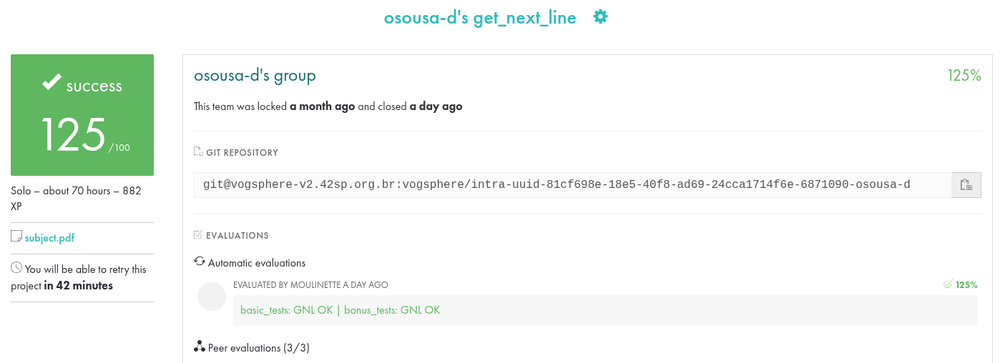

# Get_next_line-42  

📌 **get_next_line**  
O **get_next_line** é um projeto da 42 que tem como objetivo criar uma função que retornar, linha por linha, de um arquivo de texto (File descriptor - fd).  
Permitindo a leitura do arquivo somente por blocos até a quebra de linha (\n) ou até o fim do arquivo (leu todos os caracteres do arquivo).
Retornando o (\n) dentro da linha.

---

### 🎯 Objetivo  
- Escrever uma função que retorna uma linha lida de um file descriptor, respeitando algunas regras. 
- Desenvolver melhor compreensão sobre manipulação de strings, macros (`BUFFER_SIZE`), organização de código, corrigir vazamentos de memórias e formatação de saída.  
- Melhor entendimento da função `read`.
---

### 🚀 Como compilar

O projeto vem dividido em arquivos (se for o bônus vai ter (_bonus) no nome):

get_next_line.c

get_next_line_utils.c

get_next_line.h

---

### 🛠️ Crie sua Main.c

📌 Aqui, o main.c é um arquivo de teste que você mesmo cria para chamar a função get_next_line.
```
#include "get_next_line.h"
#include <stdio.h>

int main(void)
{
    int fd = open("teste.txt", O_RDONLY);
    char *line;

    while ((line = get_next_line(fd)))
    {
        printf("%s", line);
        free(line);
    }
    close(fd);
    return (0);
}

```
Crie qualquer arquivo .txt dentro da pasta aonde está o projeto, com qualquer conteudo (não esqueça de dar enter para quebrar a linha).

E coloque o nome do seu arquivo entre aspas nessa linha na main.c.

```int fd = open("teste.txt", O_RDONLY);```

Para compilar, no terminal use o gcc com o BUFFER_SIZE definido. Exemplo:

```gcc -Wall -Wextra -Werror -D BUFFER_SIZE=42 get_next_line.c get_next_line_utils.c main.c -o gnl```

Depois de compilado rode:

```./gnl```

Para verificar se há vazamentos de memoria:

```valgrind --leak-check=full --show-leak-kinds=all ./gnl```

E se tudo estiver correto vai mostrar essa informação:

```All heap blocks were freed -- no leaks are possible```

---

### ✅ Checklist de correção

- Compila sem erros (-Wall -Wextra -Werror)

- Funciona com diferentes tamanhos de BUFFER_SIZE

- Lê arquivos de diferentes tamanhos

- Funciona em múltiplos FDs abertos ao mesmo tempo

- Não apresenta leaks de memória

---

### 🎁 Bônus

Dentro da pasta project_with_bonus

📅 **Período de desenvolvimento**  
- Início: 02/09/2025  
- Término: 24/09/2025  

---


